# Bachao — Pakistan Safety Intelligence Platform

> بچاؤ · "Save / Protect"

**Bachao** is a real-time personal safety platform built for Karachi, Pakistan. It combines machine learning, live crime data, and SMS alerts to help users travel safely, report incidents, and stay aware of high-risk zones.

---

## 🌐 Live Demo

| Service | URL |
|---|---|
| Web Dashboard | [https://bachao-pk.onrender.com](https://bachao-pk.onrender.com) |
| Backend API | [https://bachao-backend.onrender.com](https://bachao-backend.onrender.com) |
| API Docs | [https://bachao-backend.onrender.com/docs](https://bachao-backend.onrender.com/docs) |

---

## Live Project

The full application lives in [`outputs/bachao-pakistan/`](./outputs/bachao-pakistan/) and consists of three parts:

| Part | Stack | Purpose |
|---|---|---|
| `backend/` | FastAPI · Python · scikit-learn | REST API, ML risk scoring, SMS alerts |
| `web/` | React · Vite · Leaflet | Browser dashboard with live maps |
| `mobile/` | Expo · React Native | iOS / Android / Web app |

→ **[Full setup & deployment guide](./outputs/bachao-pakistan/README.md)**

---

## Key Features

- **Journey Guardian** — Timed journeys with auto SMS alerts to emergency contacts if you don't check in
- **Crime Heatmap** — Live map of hotspots, risk signals, and incidents across Karachi
- **Safe Signals** — Radar view of nearby threats with HIGH / MEDIUM / LOW risk levels
- **ML Risk Scoring** — RandomForest model predicts journey risk from time, route, and area crime index
- **Incident Reporting** — Citizen reports feed back into the ML training pipeline
- **AI Insights** — Claude-powered safety assistant

---

## Screenshots

### 🌐 Web Dashboard

<table>
  <tr>
    <td align="center">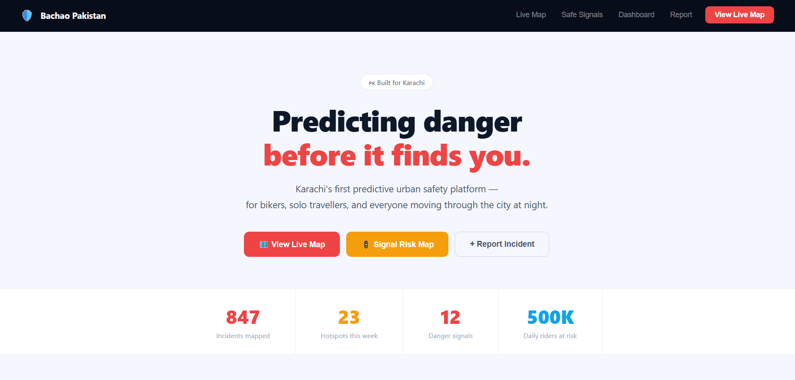</td>
    <td align="center">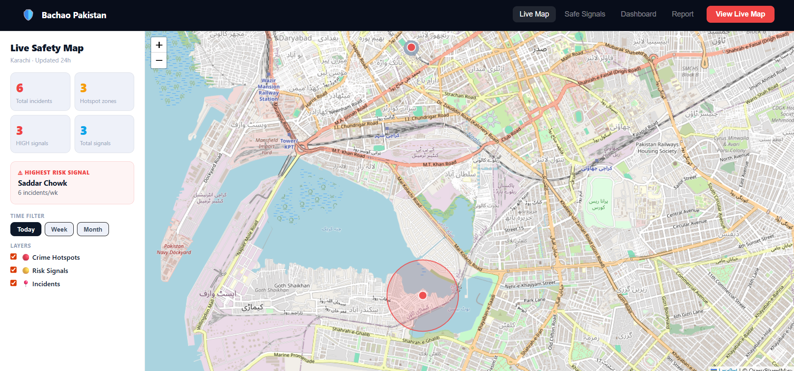</td>
  </tr>
  <tr>
    <td align="center">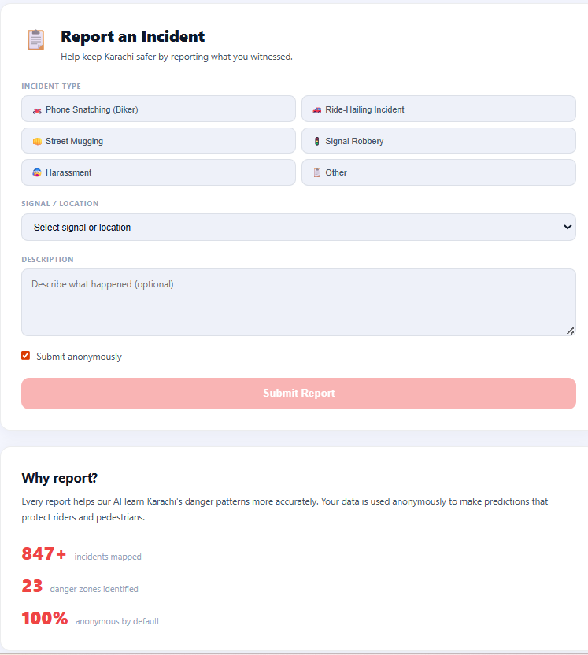</td>
    <td align="center">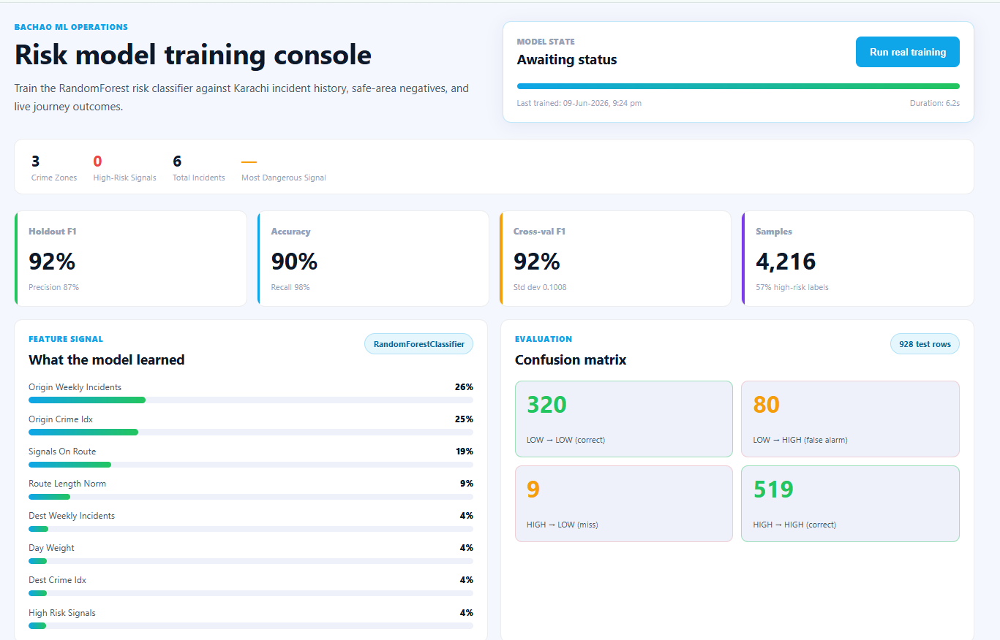</td>
  </tr>
  <tr>
    <td align="center">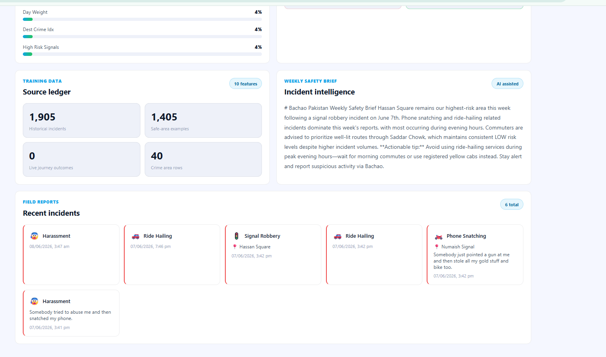</td>
    <td align="center">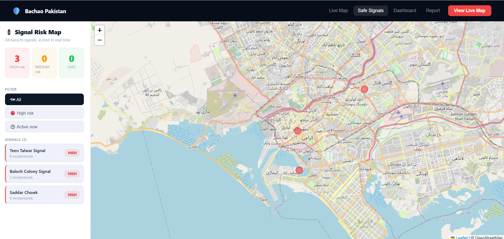</td>
  </tr>
</table>

### 📱 Mobile App

<table>
  <tr>
    <td align="center"></td>
    <td align="center">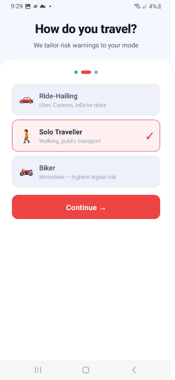</td>
    <td align="center">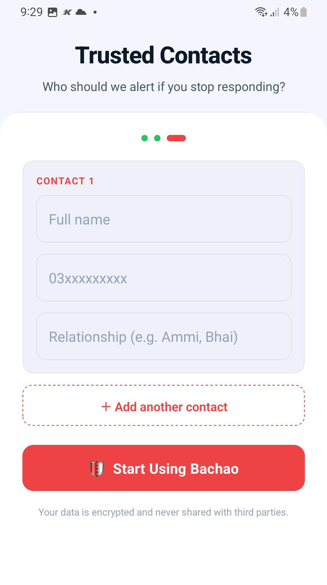</td>
  </tr>
  <tr>
    <td align="center">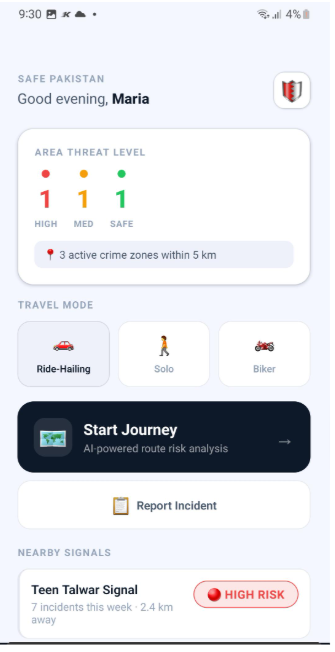</td>
    <td align="center">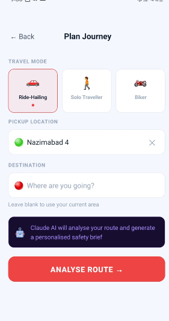</td>
    <td align="center">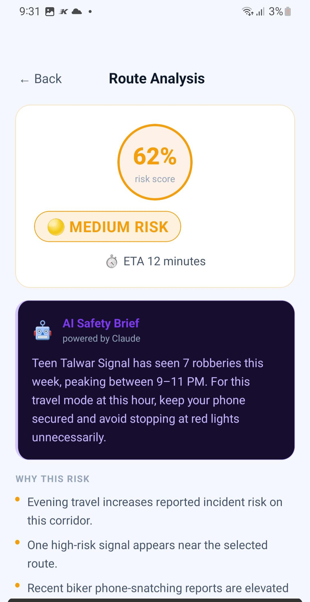</td>
  </tr>
  <tr>
    <td align="center">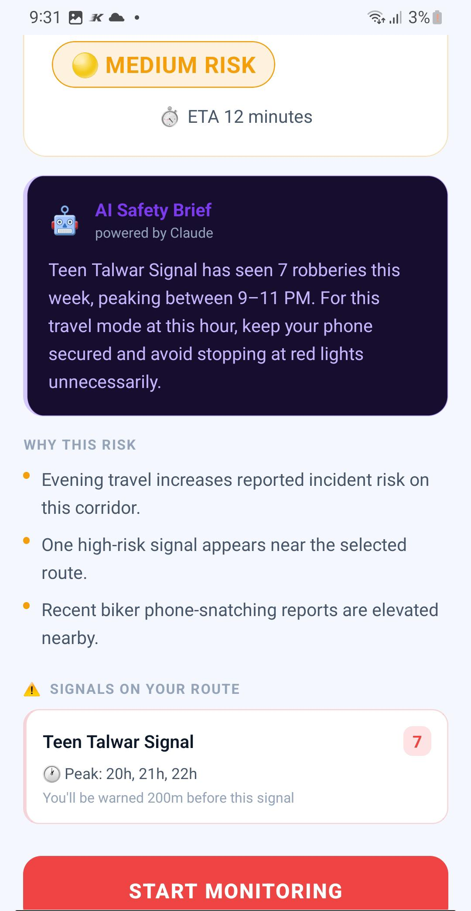</td>
    <td align="center">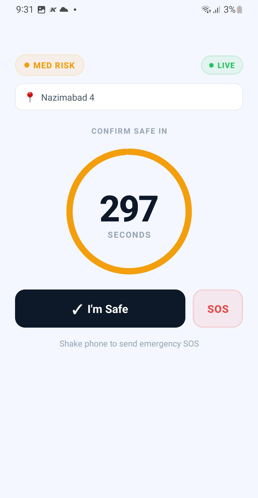</td>
    <td align="center"></td>
  </tr>
</table>

---

## Quick Start

```bash
# Backend
cd outputs/bachao-pakistan/backend
pip install -r requirements.txt
uvicorn main:app --reload --port 8000

# Web
cd outputs/bachao-pakistan/web
npm install && npm run dev

# Mobile
cd outputs/bachao-pakistan/mobile
npm install --legacy-peer-deps && npx expo start
```

---

## Tech Stack

`FastAPI` · `scikit-learn` · `Firebase Firestore` · `Twilio` · `React` · `Vite` · `React Leaflet` · `Expo` · `React Native` · `Anthropic Claude`

---

## License

MIT © 2024 Bachao Pakistan
